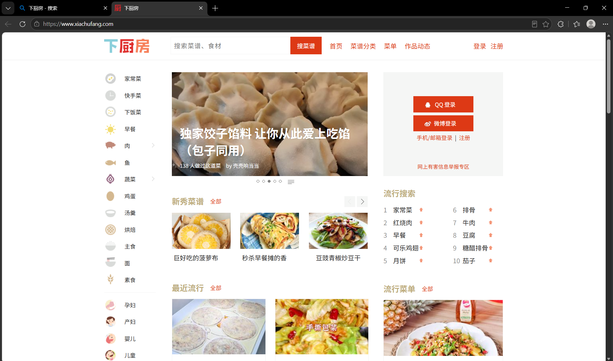
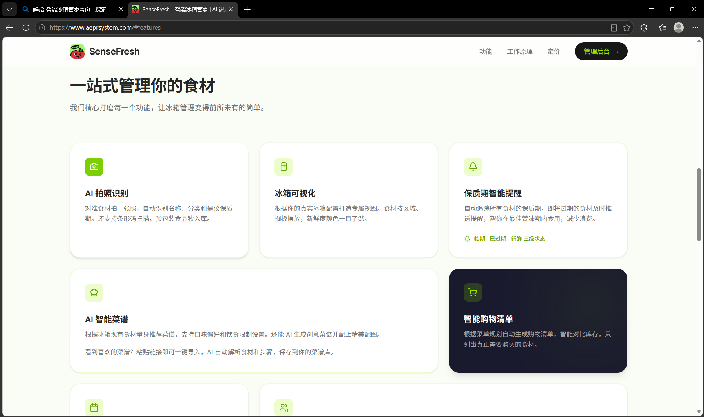

# 实验2：个人软件选题与需求分析

## 一、个人项目方案

### 1.1 项目基本信息

| **项目** | **内容**                                                                                           |
| -------- | -------------------------------------------------------------------------------------------------- |
| 项目名称 | AI冰箱食材"寿命"匹配器                                                                             |
| 项目类型 | 个人生活管理与AI辅助决策软件                                                                       |
| 主要用户 | 有冰箱、希望减少食材浪费的学生和年轻家庭用户                                                       |
| 项目难度 | 中等                                                                                               |
| 核心问题 | 用户不知道冰箱中的哪些食材最需要优先处理，也难以根据现有食材快速形成可执行的料理方案               |
| 核心价值 | 以"清库存"为第一目标，根据食材剩余寿命生成今天优先消耗的料理方案，并列出完成料理所需的采购补缺清单 |

### 1.2 一句话产品定位

AI冰箱食材"寿命"匹配器帮助用户把"快过期、已有库存、口味偏好"转化为今天可以执行的料理方案，优先减少食材浪费，而不是单纯推荐热门菜谱。

### 1.3 核心用户流程

1. 用户录入或拍照识别冰箱中的食材，并填写数量、购买日期或预计到期日。
2. 用户选择今天的口味偏好、用餐人数、可用厨具、烹饪时间和忌口信息。
3. 系统根据食材剩余寿命、食材搭配关系和用户条件，计算优先消耗顺序。
4. AI生成一至三套料理方案，说明优先使用哪些食材、预计用量、步骤和替代方案。
5. 用户确认方案后，系统列出缺少的关键食材，形成采购补缺清单。
6. 用户完成烹饪后标记已消耗食材，库存和剩余寿命同步更新。

### 1.4 使用前后的可观察变化

使用前，用户需要打开冰箱逐件判断食材状态，再临时搜索菜谱，容易忽略快过期食材或重复购买已有食材。使用后，用户可以先看到"今天必须优先处理"的食材，获得基于现有库存的料理方案，并只采购完成方案所需的缺口食材。

## 二、选题来源与问题陈述

### 2.1 选题来源

本选题来自日常冰箱管理中的真实问题：食材购买后经常被放在冰箱深处，用户记不清购买日期和到期时间；临近用餐时通常按照"想吃什么"搜索菜谱，而不是按照"什么食材最需要处理"决定菜单。这会造成食材过期、重复购买和临时点外卖等问题。

本报告将部分人群经历作为初步问题来源。为了在后续提交时形成更充分的证据，现补充一次简短访谈记录，访谈对象包括3名独居学生/年轻家庭成员。

用户访谈记录：

访谈日期：2026‑09‑19

访谈形式：线上简短文字访谈

访谈对象：

S1：大二在校学生，校外独居出租屋，每周做饭4‑5次

S2：刚毕业独居上班族，租房居住，工作日简单做饭

S3：年轻合租二人小家庭，两个人日常开火做饭

访谈问题1：你通常如何记录或判断冰箱食材的保质期？

S1：基本全靠脑子记，不会专门记录。食材外包装没扔就看包装日期，叶子菜拆开包装之后就完全凭感觉看菜蔫不蔫，冰箱深处的食材经常直接被遗忘。

S2：不会用APP记录，偶尔手机备忘录随手记一下买了啥，但不会写到期时间。肉类会记住大概购买星期，蔬菜水果完全看外观状态判断还能不能吃。

S3：两个人都不会做系统化记录。买回来的食材直接丢冰箱，只有看到食材已经发黄、腐烂才知道不能吃，经常分不清哪些是较早买的。

访谈问题2：过去一个月是否有食材因忘记使用而过期？

S1：有，发生过2‑3次。青菜、小番茄放在冰箱角落忘记吃，等到发现已经烂掉，只能直接丢掉，挺心疼的。

S2：有的，一盒金针菇还有半把生菜放坏。下班经常懒得做饭点外卖，冰箱里菜就一直放着。

S3：几乎每周都会丢掉一部分绿叶蔬菜。有时候买得多，没来得及吃就老化变质，肉类还好，蔬菜浪费情况最严重。

访谈问题3：你选择菜谱时更看重口味、时间、现有食材还是营养？

S1：优先口味和烹饪时间，学生时间有限，不想做太复杂。很少会先看冰箱有什么再找菜，大多是刷到想吃的菜谱再去准备食材。

S2：烹饪时间排第一，下班很累，希望20‑30分钟做完饭，其次是口味。现有食材只会顺带考虑，不会为了消耗库存专门选不好吃的菜。

S3：兼顾口味和家庭成员接受度，其次是现有食材。一般想到想吃什么菜再做饭，不会优先优先消耗冰箱里面快要放坏的食材。

访谈问题4：你是否愿意为了完成一道菜额外购买一至三种食材？

S1：最多愿意额外买1‑2种，如果要买三样及以上就不太想做这道菜了，觉得麻烦又增加开销，不如换家里食材能直接做的菜。

S2：可以接受1‑2种补缺食材。如果需要买很多配料，会直接放弃这个菜谱。

S3：接受最多2‑3种，但优先希望尽量使用家里已有的存货；补购太多的话会觉得本末倒置。

访谈问题5：如果AI给出的方案涉及不确定的新鲜度，你希望软件如何提醒？

S1：一定要很醒目的红色提示，不要直接把这个食材放进做菜方案。软件不要替我判断能不能吃，只提醒我手动检查，由我自己决定要不要用。

S2：不要自动把存疑食材加入菜谱。最好单独弹窗提示风险，说明该食材新鲜度不确定，建议仔细查看状态，不能直接生成包含该食材的做菜方案。

S3：希望把不确定新鲜度的食材单独拎出来高亮，不要混在正常库存里面；明确告知风险，软件绝对不能推荐使用疑似变质的食材做菜。

访谈归纳结论

1\. 目标用户普遍缺少有效的冰箱食材保质期记录手段，绝大多数依靠人脑记忆，冰箱深处食材极易被遗忘，食材过期浪费是高频真实痛点。

2\. 用户选择菜谱的决策逻辑是"想吃什么"优先，很少主动优先消耗临期库存，这正是本软件需要解决的核心矛盾。

3\. 用户能够接受少量（1‑3种）食材补购，但补购数量过多时用户会直接放弃该料理方案，软件需要提供"仅使用现有库存"模式。

4\. 面对新鲜度不确定的食材，用户拒绝AI替人做食品安全判断；期望软件做风险高亮提示，强制交由用户人工确认，禁止直接生成使用可疑食材的菜谱。

**2.2 问题陈述**

- **目标用户：** 有日常做饭需求、需要管理冰箱库存的学生和年轻家庭用户。
- **当前情境：** 用户准备做饭，但冰箱内有多种剩余食材，部分食材购买时间较早，用户还没有明确菜单。
- **主要困难：** 用户无法快速判断哪些食材应该优先食用，也不知道如何把零散库存组合成符合口味和时间限制的料理。
- **造成影响：** 食材过期浪费、重复购买、做饭决策耗时增加，甚至因为缺少关键配料而放弃在家做饭。
- **拟解决方式：** 记录食材的预计保质信息，以剩余寿命和清库存为主要排序依据，再结合用户偏好生成料理方案和采购补缺清单。

### 2.3 问题假设

| **假设**                         | **验证方式**           | **可能结论**                                           |
| -------------------------------- | ---------------------- | ------------------------------------------------------ |
| 用户愿意维护简化的冰箱库存       | 访谈、可用性测试       | 若手动录入成本过高，则优先实现快速录入和批量编辑       |
| 用户更关心"先吃什么"而非菜谱数量 | 原型测试、问卷         | 首页突出优先处理列表，不突出无限菜谱浏览               |
| 用户能接受少量补购               | 场景访谈、验收测试     | 默认限制补购项数量，并提供"仅使用现有食材"模式         |
| AI方案需要用户确认               | 试用记录、错误案例分析 | 对食材状态不确定、过敏和高风险食品不直接给出确定性结论 |

## 三、用户画像与使用场景

### 3.1 主要用户画像

**用户A：独居大学生**

- 目标：在有限预算和时间内完成一顿饭，尽量消耗已有食材。
- 能力：会使用手机应用，但不愿填写复杂表单；具备基础烹饪能力。
- 使用环境：回到宿舍或出租屋后，通过手机查看冰箱库存。
- 约束：预算有限、厨具不完整、用餐人数通常为1人、食材数量少且种类杂。
- 痛点：记不住食材什么时候买的，面对剩菜和零散配料不知道如何组合。

### 3.2 次要用户画像

**用户B：年轻家庭成员**

- 目标：根据家庭成员口味和忌口安排一至两天的菜单，减少重复采购。
- 能力：有一定烹饪经验，但希望减少计划时间。
- 使用环境：采购前或晚餐准备前使用手机。
- 约束：用餐人数较多，口味和过敏信息更复杂，对食品安全提醒更敏感。

MVP阶段只重点服务用户A，用户B的多人用餐和家庭共享作为后续扩展方向。

### 3.3 正常场景

| **编号** | **场景**                                               | **系统响应**                                                     |
| -------- | ------------------------------------------------------ | ---------------------------------------------------------------- |
| N1       | 用户录入鸡蛋、番茄、青菜，并填写青菜预计两天内需要食用 | 将青菜置于优先处理位置，推荐番茄炒蛋、青菜蛋花汤等方案           |
| N2       | 用户输入现有食材和"清淡、20分钟内、1人份"              | 生成符合时间和口味的方案，显示预计用量与剩余库存                 |
| N3       | 用户选择某方案并确认执行                               | 生成缺少的关键食材清单，同时允许用户忽略非必需配料               |
| N4       | 用户烹饪完成后标记食材已消耗                           | 更新对应食材数量，并保留未使用的剩余数量                         |
| N5       | 用户只希望消耗现有食材，不想采购                       | 关闭补购项，重新生成"仅使用库存"方案，并说明可能的口味或营养限制 |

### 3.4 异常场景

| **编号** | **场景**                                                         | **系统响应**                                                                             |
| -------- | ---------------------------------------------------------------- | ---------------------------------------------------------------------------------------- |
| A1       | 用户只输入"有一些蔬菜"，没有品种、数量或时间信息                 | 提示补充必要信息；在信息不足时只给出低风险的通用处理建议，不生成精确保质期结论           |
| A2       | 用户输入的食材已超过预计保质期，或用户描述有异味、变色、包装破损 | 标记为"需要人工确认"，优先建议检查、丢弃或咨询专业食品安全信息，不把它作为可食用食材推荐 |
| A3       | 用户填写了严重过敏或忌口信息，但生成方案仍包含相关食材           | 阻止方案确认，要求重新生成并将过敏食材列为硬性排除项                                     |
| A4       | AI服务超时或不可用                                               | 使用规则排序和本地模板生成基础方案，明确说明当前为降级结果                               |
| A5       | 食材数量不足以完成方案                                           | 只将真正影响完成料理的食材加入补缺清单，并说明替代食材或减少份量的选择                   |

## 四、现有方案比较与差异化

### 4.1 调研对象

本次初步调研选择三类已有方案进行比较：下厨房等菜谱平台、购物清单或家庭库存管理应用、用户自己记录或凭记忆管理冰箱。本次调研访问日期：2026‑09‑20。现有方案界面截图见附录AS01、S02；调研来源链接详见 10.3 证据材料清单。

| **方案**                 | **功能**                                         | **成本**                       | **隐私**                 | **易用性**                                 | **AI能力**                     | **尚未解决的问题**                                                       |
| ------------------------ | ------------------------------------------------ | ------------------------------ | ------------------------ | ------------------------------------------ | ------------------------------ | ------------------------------------------------------------------------ |
| 菜谱平台（如下厨房）     | 菜谱搜索、分类、收藏、评论                       | 通常免费，可能有广告或会员内容 | 搜索和账号行为可能被记录 | 菜谱丰富，但需要用户先决定想吃什么         | 可能提供个性化推荐             | 目标通常是发现菜谱，未必优先处理临期库存                                 |
| 冰箱库存管理 App（鲜觉） | 录入冰箱食材、保质期提醒、简单菜谱推荐、采购清单 | 免费基础功能，高级功能会员     | 存储用户冰箱食材库存信息 | 可以记录食材，但录入繁琐；菜谱只是次要功能 | 基础 AI 识别，菜谱匹配能力有限 | 可以记录食材到期，但菜谱推荐不以临期食材为最高优先级，缺少完整清库存闭环 |
| 手写、备忘录或凭记忆     | 低成本记录购买事项                               | 基本无额外成本                 | 数据可由用户自行控制     | 录入简单，但查询和更新不稳定               | 无                             | 难以自动排序、搭配食材和生成缺口清单                                     |

### 4.2 本项目差异化

1. **清库存优先：** 以食材剩余寿命、数量和浪费风险作为首要排序因素，而不是以热门度或用户搜索词作为首要因素。
2. **库存到料理闭环：** 从"我有什么"开始，直接输出"今天做什么、消耗什么、还缺什么"。
3. **允许用户控制：** 用户可以选择仅使用现有食材、限制补购数量、调整口味和烹饪时间。
4. **安全边界清晰：** 软件不依据模糊图片或气味描述替用户判断食品绝对安全；不确定时要求用户人工确认。
5. **可解释结果：** 每个方案展示优先推荐某食材的原因、预计消耗量和未使用库存，方便用户判断是否接受。

### 4.3 本项目明确不解决的问题

- 不替代医生、营养师或食品安全监管机构提供专业诊断。
- 不对食材是否绝对安全作出保证，不处理严重变质食品的挽救问题。
- MVP不实现自动下单、支付、配送和商超价格实时比价。
- MVP不实现复杂的家庭多人账号、跨设备同步和智能冰箱硬件联动。
- MVP不追求覆盖所有地方菜系、专业厨师流程和精确营养治疗方案。

## 五、用户故事与用例分析

### 5.1 用户故事

| **编号** | **用户故事**                                                                                       | **优先级** |
| -------- | -------------------------------------------------------------------------------------------------- | ---------- |
| US-01    | 作为独居用户，我希望记录食材名称、数量和预计到期日，以便知道冰箱里有什么以及哪些食材需要优先处理。 | P0         |
| US-02    | 作为独居用户，我希望输入口味、烹饪时间和用餐人数，以便获得符合当前条件的料理方案。                 | P0         |
| US-03    | 作为独居用户，我希望系统说明方案会消耗哪些库存，以便判断推荐是否真的有助于清理冰箱。               | P0         |
| US-04    | 作为独居用户，我希望查看采购补缺清单，以便只购买完成料理所需的关键食材。                           | P0         |
| US-05    | 作为用户，我希望标记已消耗或丢弃的食材，以便库存状态保持准确。                                     | P0         |
| US-06    | 作为有忌口的用户，我希望设置过敏和不喜欢的食材，以便生成结果不会包含不能食用的内容。               | P0         |
| US-07    | 作为用户，我希望在AI不可用时仍能获得基础处理建议，以便核心功能不会完全中断。                       | P1         |
| US-08    | 作为家庭用户，我希望共享库存和菜单，以便多人共同维护冰箱信息。                                     | P2         |

### 5.2 核心用例描述

| **用例编号** | **描述**                                             | **优先级** | **来源**     | **依赖**     | **验收方法**         |
| ------------ | ---------------------------------------------------- | ---------- | ------------ | ------------ | -------------------- |
| UC-01        | 新增、编辑、删除食材，维护名称、数量、单位和日期信息 | P0         | US-01        | 无           | 功能测试、界面测试   |
| UC-02        | 设置口味、忌口、过敏、人数、时间和厨具               | P0         | US-02、US-06 | 无           | 功能测试             |
| UC-03        | 按剩余寿命排序并生成料理方案                         | P0         | US-02、US-03 | UC-01、UC-02 | 验收示例、AI结果评测 |
| UC-04        | 展示方案的库存消耗和采购补缺项                       | P0         | US-04        | UC-03        | 功能测试、人工核对   |
| UC-05        | 标记食材已消耗、部分消耗或丢弃                       | P0         | US-05        | UC-01        | 功能测试             |
| UC-06        | 对信息不足、疑似变质和AI失败进行提示或降级           | P0         | A1、A2、A4   | UC-01        | 异常测试             |

### 5.3 非功能需求

| **类别**   | **需求**                       | **验收指标**                                                     |
| ---------- | ------------------------------ | ---------------------------------------------------------------- |
| 性能       | 常规库存规模下完成一次方案请求 | 页面操作反馈不超过2秒；AI请求在30秒内返回或显示超时状态          |
| 可靠性     | AI服务不可用时保留核心使用能力 | 能使用规则排序；已保存的库存数据不因请求失败丢失                 |
| 安全与隐私 | 保护库存、忌口和账号数据       | 不在日志中记录完整个人敏感信息；涉及第三方模型时显示数据使用提示 |
| 可用性     | 用户能够理解推荐原因并修正输入 | 首次用户在3分钟内完成至少5种食材录入；错误输入有明确提示         |
| 可解释性   | 推荐结果能够追溯到库存和偏好   | 每个方案至少显示优先食材、预计用量、缺口食材和生成依据           |

## 六、核心验收示例

### 验收示例1：正常生成方案

- **Given：** 用户库存中有番茄3个、鸡蛋2个、青菜1把；青菜预计明天需要处理；用户选择清淡、20分钟内、1人份。
- **When：** 用户点击"生成今天方案"。
- **Then：** 系统返回至少1个可执行方案；方案优先使用青菜，并显示使用食材、预计用量、烹饪时间和步骤；不要求用户采购库存已有的番茄或鸡蛋。

### 验收示例2：信息不足

- **Given：** 用户只输入"有蔬菜"，没有具体品种、数量或日期信息。
- **When：** 用户请求生成料理方案。
- **Then：** 系统提示补充至少一种具体食材和大致数量；在信息补全前不得输出带有精确保质期判断的结果；可提供通用的低风险处理建议。

### 验收示例3：需要人工确认

- **Given：** 用户输入某食材已过预计日期，并备注"有异味、表面发黏"。
- **When：** 用户请求生成方案。
- **Then：** 系统将该食材标记为"需要人工确认"，不把它计入可食用库存和推荐菜谱；显示停止食用或寻求专业判断的提示；用户必须主动确认后才能继续处理该条记录。

### 验收示例4：忌口拦截

- **Given：** 用户设置对花生过敏，库存中有花生酱和其他食材。
- **When：** AI生成包含花生酱的方案。
- **Then：** 系统拦截方案确认，指出与过敏设置冲突，并提供重新生成或删除该食材的操作。

### 验收示例5：AI不可用时降级

- **Given：** 用户已经保存了食材名称、数量和预计日期，但AI服务请求超时。
- **When：** 系统在规定时间内未收到模型结果。
- **Then：** 系统保留库存数据，按剩余寿命显示优先处理列表，并从预置模板中提供基础方案；页面明确标注结果为规则降级结果，不伪装成AI生成结果。

## 七、AI能力必要性与可行性分析

### 7.1 AI处理任务

AI主要承担以下任务：

- 将用户的自然语言输入整理为结构化食材、数量、单位和处理备注。
- 根据库存食材、剩余寿命、口味、时间、人数和厨具生成料理方案。
- 从料理方案中提取实际会消耗的食材，并计算关键缺口。
- 根据用户反馈调整方案，例如"不要辣""不想开火""今天只想用掉青菜"。

固定规则适合完成日期排序、库存扣减、忌口硬性拦截和补缺集合计算，但很难覆盖自然语言表达、食材之间的多种搭配、烹饪步骤组织和用户临时偏好。因此，本项目采用"规则负责安全和确定性约束，AI负责理解与生成"的组合方式。

### 7.2 模型输入与期望输出

**输入：**

- 食材名称、数量、单位、购买日期或预计到期日、储存方式和用户备注。
- 用户口味偏好、忌口、过敏信息、用餐人数、烹饪时间和可用厨具。
- 系统计算的剩余寿命等级和必须排除的食材列表。

**输出：**

- 方案名称与简短说明。
- 优先消耗食材及其预计用量。
- 其他库存食材及其用量。
- 烹饪步骤、预计耗时和难度。
- 可选替代食材。
- 必需采购项和可选采购项。
- 不确定性提醒，以及需要用户确认的事项。

输出应要求模型使用结构化格式，便于程序校验和展示。系统在保存或执行前必须再次校验过敏食材、库存数量、时间限制和方案字段完整性。

### 7.3 风险与控制措施

| **风险**     | **表现**                                             | **控制措施**                                                                 |
| ------------ | ---------------------------------------------------- | ---------------------------------------------------------------------------- |
| 保质期误判   | 用户填写的日期不准确，模型把不安全食材当作可食用食材 | 日期排序使用规则计算；疑似变质信息直接进入人工确认流程；不向用户保证绝对安全 |
| 模型幻觉     | 生成不存在的库存或不合理步骤                         | 只允许使用结构化库存；对输出食材做白名单校验；显示方案依据                   |
| 过敏风险     | 方案包含用户设置的过敏食材                           | 规则层硬性拦截，拦截后不得直接确认方案                                       |
| 结果不合口味 | 用户偏好理解错误                                     | 支持重新生成、修改偏好和反馈；记录失败案例用于评测                           |
| 隐私泄露     | 库存、健康偏好或家庭信息发送给第三方模型             | 最小化发送字段，提供隐私说明，不发送不必要的身份信息                         |
| 成本和时延   | 高频调用模型导致费用或等待时间增加                   | 控制每次生成长度，缓存相同请求，超时后启用规则降级                           |

### 7.4 数据来源、服务与评测

- **数据来源：** 用户主动输入的库存数据、用户设置的偏好和项目自建的常见食材/料理模板。初期不依赖大规模个人数据集。
- **模型服务：** MVP可接入一个可调用的中文大语言模型API；同时保留本地规则模块，避免服务不可用时整个流程中断。
- **费用：** 控制上下文长度和输出长度，优先生成少量方案；在开发阶段使用小模型或测试额度。
- **时延：** 设置请求超时和加载状态，超过阈值后显示规则排序结果。
- **评测方法：** 使用人工构造的10至20组库存样例，从临期优先、忌口遵守、库存真实性、补缺准确性、步骤可执行性和用户满意度进行评分。
- **允许错误：** 菜名表达和非关键调味建议可以有一定偏差；不得接受过敏冲突、虚构库存、把疑似变质食材用于方案、遗漏关键补购项等错误。

### 7.5 非AI降级方案

1. 使用规则按剩余寿命、数量和类别排序，生成"优先处理列表"。
2. 根据食材类别匹配预置料理模板，例如"蛋类+蔬菜""米饭+剩余肉类"。
3. 通过集合运算计算方案需要但库存不存在的食材。
4. 只输出确定性较高的基础建议，并明确提示用户自行确认食材状态。

### 7.6 三组AI验收输入

| **组别**      | **输入**                                                                | **期望输出**                                                                   | **判定方法**                                     |
| ------------- | ----------------------------------------------------------------------- | ------------------------------------------------------------------------------ | ------------------------------------------------ |
| AI-01正常     | 库存：青菜1把、鸡蛋2个、番茄3个；青菜剩余1天；偏好：清淡、20分钟、1人份 | 方案优先消耗青菜；消耗量不超过库存；输出完整步骤；补缺项不包含已有库存         | 与结构化库存逐项比对，人工检查耗时和可执行性     |
| AI-02约束     | 库存：鸡肉、土豆、花生酱；用户：花生过敏、少油、30分钟                  | 方案不得使用花生酱；最好给出无花生替代方案；若无法满足则要求用户确认或重新生成 | 规则拦截测试，检查输出中是否出现过敏食材         |
| AI-03无法处理 | 食材备注：已过期、有异味、发黏；数量不明确                              | 不生成将其作为可食用库存的菜谱；标记人工确认并提示停止食用或寻求专业判断       | 结果字段和页面状态检查，确认方案无法绕过人工确认 |

## 八、MVP范围与后续扩展

### 8.1 MVP纳入功能

- 手动新增、编辑和删除食材。
- 记录名称、数量、单位、日期、储存位置和状态备注。
- 计算剩余寿命等级，展示"今天优先处理"列表。
- 设置口味、忌口、过敏、用餐人数、时间和厨具。
- AI生成最多三套清库存料理方案。
- 展示方案消耗明细、库存剩余和采购补缺清单。
- 标记已消耗、部分消耗、丢弃和需要人工确认。
- AI请求失败时使用规则和模板降级。

### 8.2 本学期不纳入功能

- 图片识别全部食材和自动读取包装日期。
- 自动连接智能冰箱、扫码设备或物联网硬件。
- 超市实时价格、在线下单和配送。
- 家庭多人协作、云同步和复杂账号体系。
- 精确营养分析、疾病膳食建议和个性化医学方案。
- 覆盖所有菜系的专业菜谱数据库。

### 8.3 计划删减与替代方案

若开发进度延期，优先保留"手动录入库存—临期排序—生成方案—补缺清单—更新库存"主流程。图片识别改为上传后人工确认；复杂AI对话改为一次性表单生成；云端数据库改为本地数据存储；多方案改为只生成一套最优方案。

## 九、第2—17周个人计划

| **周次** | **任务**                         | **可运行成果**              | **验收条件与风险**                           |
| -------- | -------------------------------- | --------------------------- | -------------------------------------------- |
| 第2周    | 完成选题、问题陈述和初步访谈提纲 | 需求说明V1初稿              | 明确目标用户、核心问题和边界                 |
| 第3周    | 完成3名用户访谈或观察，整理证据  | 访谈摘要和需求修订记录      | 至少归纳3条可验证用户需求                    |
| 第4周    | 调研现有方案，确定MVP            | 竞品比较表、产品流程图      | 能说明本项目与菜谱推荐的差异                 |
| 第5周    | 设计数据结构和核心页面           | 低保真原型                  | 完成库存、偏好、结果、清单四个页面草图       |
| 第6周    | 搭建项目框架和本地存储           | 可启动的基础工程            | 页面可访问，数据可新增和读取                 |
| 第7周    | 实现食材库存管理                 | 库存管理可运行版本          | 能新增、编辑、删除和标记食材                 |
| 第8周    | 实现剩余寿命排序                 | 优先处理列表                | 日期和状态排序结果正确                       |
| 第9周    | 实现偏好和忌口设置               | 条件输入页面                | 缺少必要字段时有提示，过敏项可保存           |
| 第10周   | 接入AI服务并设计提示词           | 首版AI方案生成              | 能返回结构化方案并显示加载、失败状态         |
| 第11周   | 实现输出校验和补缺清单           | 方案与清单联动              | 不虚构库存，能够区分必需和可选采购项         |
| 第12周   | 实现消耗、丢弃和人工确认         | 库存闭环版本                | 执行方案后库存数量正确更新                   |
| 第13周   | 实现规则降级和安全拦截           | 无AI可用版本                | AI超时、过敏和疑似变质场景可处理             |
| 第14周   | 完成整体界面和可用性优化         | MVP演示版本                 | 目标用户可在3分钟内完成一次核心流程          |
| 第15周   | 完成测试样例和用户测试           | 测试记录、问题清单          | 至少覆盖3组AI验收输入和主要异常场景          |
| 第16周   | 修复问题、整理文档和操作记录     | 稳定版本、需求变更记录      | 核心验收条件全部通过或有明确已知问题         |
| 第17周   | 阶段演示、提交报告和项目归档     | 最终演示、PDF报告、仓库材料 | 展示核心流程，提交项目方案、需求说明和Commit |

主要风险包括AI接口费用或配额不足、保质期信息不准确、用户不愿持续维护库存以及开发时间不足。应在第10周前完成规则版本，在第13周前完成安全拦截，在第15周前停止扩展需求，确保MVP能够独立演示。

## 十、操作记录与需求变化

### 10.1 当前操作记录

1. 将产品重点从普通菜谱推荐调整为"清库存优先"，把临期食材排序、方案消耗明细和采购补缺列为核心功能。
2. 初步确定主要用户为独居学生，暂不把家庭协作、智能硬件和自动采购纳入MVP。

### 10.2 需求变化、删减与取舍

最初设想可能包含图片识别、智能冰箱连接、自动采购和复杂营养分析。分析后将这些功能从MVP中删减，原因是它们会扩大数据、硬件、支付和食品安全风险，且不能直接证明"减少食材浪费"这一核心价值。当前版本优先完成手动库存录入、剩余寿命排序、AI料理生成、补缺清单和库存更新五个环节，确保可以在课程周期内实现并演示完整闭环。

### 10.3 补充证据

- 记录一次冰箱库存管理观察或个人实际使用日志。

观察日志正文：

观察时间：2026‑09‑19

观察对象：某大学生出租屋冰箱真实库存

观察方式：打开冰箱清点全部食材，模拟普通用户日常管理冰箱行为 。

冰箱现有食材：青菜1把（3天前购买）、鸡蛋6枚（一周前购买）、番茄4个、半块生姜、一盒豆腐。

用户行为模拟：打开冰箱扫视一遍，能记得鸡蛋和番茄，但是青菜放在冰箱下层抽屉差点忽略；完全记不清豆腐购买时间；想要做饭时第一反应是刷菜谱软件，而不是优先消耗快要放坏的青菜。

观察发现： 1. 食材存放位置会影响用户记忆，抽屉深处食材容易被遗忘；2. 用户无法快速判断哪些食材需要优先吃掉；3. 没有任何记录手段，完全依赖人脑记忆。

- \[ \] 保存至少2个现有方案的页面截图，编号S01、S02并在报告中引用。

截图S01：下厨房网页版菜谱界面；截图S02：鲜觉‑智能冰箱管家App库存管理界面。

截图图片存放位置：附录A；调研访问日期：2026‑09‑20。

参考链接： 1. 下厨房官网：<https://www.xiachufang.com> 、 2. 鲜觉‑智能冰箱管家 App Store产品介绍页，<https://www.aeprsystem.com/>

- \[ \] 将需求说明V1提交到个人Github/Gitee仓库，并记录文件路径和Commit。

## 十一、实验小结

本实验最终确定的项目是AI冰箱食材"寿命"匹配器，核心用户流程是"录入库存—填写限制—识别优先处理食材—生成料理方案—形成采购补缺清单—更新库存"。项目的差异不在于提供更多菜谱，而在于以减少浪费和清理已有库存为第一目标。

MVP只保留能够证明核心价值的库存管理、寿命排序、AI方案、补缺清单、状态更新和失败降级功能；图片识别、智能硬件、自动下单、家庭协作和专业营养分析暂不实现。AI在自然语言理解、食材组合和料理步骤生成方面具有必要性，但日期排序、过敏拦截、库存扣减和异常处理必须由规则负责。通过人工确认点和非AI降级方案，可以降低模型幻觉、食品安全和服务不可用带来的风险。

**附录A 现有方案调研截图**

| 编号 | 截图说明                     | 来源                                           | 访问日期  |
| ---- | ---------------------------- | ---------------------------------------------- | --------- |
| S01  | 下厨房网页版菜谱浏览页面     | 下厨房官网<https://www.xiachufang.com>         | 2026-9-20 |
| S02  | 鲜觉‑智能冰箱管家App食材库存 | App Store产品截图<https://www.aeprsystem.com/> | 2026-9-20 |

图S01 下厨房网页版菜谱浏览页面

图S02 鲜觉-智能冰箱管家App食材库存管理界面
